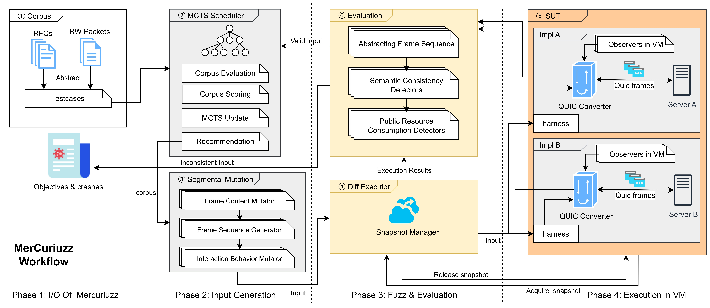

# MerCuriuzz

*MerCuriuzz* is a testing method capable of automatically discovering logical vulnerabilities in QUIC implementations.



## Usage

Currently, we have released our fuzzer developed with [LibAFL](https://github.com/AFLplusplus/LibAFL) and our mutator and validator module. You can get more detail in its [Usage.md](./Usage.md).

## How to cite us?

This framework is based on our latest research,"Identifying Logical Vulnerabilities in QUIC Implementations", accepted at NDSS '26.

If you want to cite us, please use the following (BibTeX) reference:

```
@inproceedings{Wang2026identifying,
  title={{Identifying Logical Vulnerabilities in QUIC Implementations}},
  author={Wang, Kaihua and Chen, Jianjun and Chen, Pinji and Zhuge, Jianwei and Bai, Jiaju and Duan, Haixin},
  booktitle={Proceedings 2026 Network and Distributed System Security Symposium},
  year={2026}
}
```
We have also uploaded our artifacts to a DOI-providing platform. Here is our DOI link: `https://doi.org/10.5281/zenodo.17015304`

## Disclaimer

Do not attempt to use these tools to violate the law. The author is not responsible for any illegal action. Misuse of the provided information can result in criminal charges.
